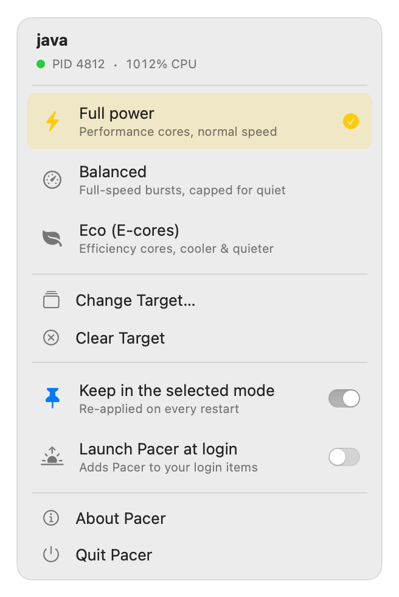

<h1 align="center">
  
  <br>
  Pacer
</h1>

<p align="center">Per-process power modes for Apple Silicon Macs.</p>

<p align="center">
  <a href="https://github.com/maxim-golubev/pacer/releases/latest"><b>Download for Apple Silicon</b></a>
</p>

<p align="center">
  <picture>
    <source media="(prefers-color-scheme: dark)" srcset="docs/images/menu-dark.gif">
    
  </picture>
</p>

Pick any running process from the menu bar and put it in one of three modes.
The change applies to the live process: nothing is restarted, and it needs no
sudo and no kernel extension.

- **Full power:** normal scheduling, performance cores at full clock.
- **Eco:** efficiency cores only. Close to silent, and about 5× slower.
- **Balanced:** performance cores at full clock, paused for part of every
  quarter second. You set the share of time it runs, and the fans follow.

Pacer remembers the target by its executable path, so when the process is
relaunched it gets the same mode again within a few seconds.

## Why three modes

I built this for an overnight Monte Carlo batch in a Java application that
uses about ten cores. At full power the fans sit at 4,500 RPM. macOS has one
tool for this, `taskpolicy -b`, and it made the job take all night.

That mode is slower than core count suggests. Background priority on Apple
Silicon moves the work to efficiency cores and also holds those cores near
1 GHz, where at full power they run at 2.6 GHz and the performance cores at
3.6 GHz. Fewer cores, a third of the clock, and a weaker core design come to
about 5×.

There is nothing between the two to switch on:

- No scheduling class gives efficiency cores at full clock.
- `taskpolicy` can clamp a process to a lower class only at launch, not on a
  running PID.
- Pinning a process to chosen cores is not supported on Apple Silicon
  (`THREAD_AFFINITY_POLICY` returns `KERN_NOT_SUPPORTED`).

Eco draws under 2 W, far less than the cooler can shed quietly. Balanced
spends that headroom: the process runs at full speed and is stopped with
`SIGSTOP` for part of each 250 ms period. The chip's thermal mass averages the
bursts, so the fans respond to the average. This is the technique `cpulimit`
uses; Pacer adds the Eco mode, following a target across relaunches, and the
guarantees below.

Measured on an M3 Pro (6 performance + 6 efficiency cores) running that batch.
Power and fan speed were read directly; speed and duration are approximate.

| Mode | CPU power | Fans | Speed vs Eco | Overnight batch |
| --- | --- | --- | --- | --- |
| Eco | 1.6 W | silent | 1× | about 10.5 h |
| Balanced 40% | 9 W | silent | about 2.5–3× | about 3.5–4 h |
| Balanced 65% | 23 W | 1,500 RPM | about 3.5–4× | about 2.5–3 h |
| **Balanced 70%** | **25 W** | **2,000 RPM** | **about 4–4.5×** | **about 2.5 h** |
| Balanced 75% | 27 W | 2,800 RPM | about 4.5–5× | about 2–2.5 h |
| Full power | 38 W | 4,500 RPM | about 6× | about 1.5–2 h |

The fan curve is steep near the top: 4 W more, from 65% to 75%, adds 1,300
RPM. So the quiet range is a narrow band of duty, and the menu has a ± control
that retunes the running process within one period. Balanced is not more
efficient than Eco per watt; it is faster for the same noise.

## A paused process must never stay paused

Balanced works by stopping someone else's process several times a second, so
the failure to rule out is leaving it stopped.

- Quitting Pacer resumes the target and lifts Eco, synchronously, before the
  app exits.
- Clearing the target, or picking another one, restores the old target first.
- A cycle that has been cancelled never sends another stop.
- If the set of PIDs changes in the middle of a cycle, the next step resumes
  both the old set and the new one.
- On launch, Pacer resumes the target once, in case an earlier copy was killed
  while the target was stopped.

One case is not covered: `kill -9` on Pacer during a pause. Recover with
`kill -CONT <pid>`.

Every change is written to the unified log, and the kernel's own view can be
read back with `taskinfo`:

```sh
log show --predicate 'subsystem == "dev.maxim.pacer"' --last 1h --style compact
sudo taskinfo <pid> | grep "eff darwin BG"     # YES in Eco, NO otherwise
```

## Limits

- Apple Silicon only, macOS 13 or later.
- It controls processes you own. Others need root, which Pacer never asks for.
- A target is every process running one executable. Helpers that run a
  different executable are not included.
- Balanced suits apps and background jobs. A command in the foreground of a
  terminal is reported by the shell as suspended each time it is paused.
- A paused process cannot draw, so an app's window can hitch in Balanced.

## Install

Requires an Apple Silicon Mac on macOS 13 or later.

1. Download `Pacer-<version>.zip` from
   [Releases](https://github.com/maxim-golubev/pacer/releases/latest), unzip
   it, and move `Pacer.app` to Applications.
2. Open it. The app is signed ad hoc, not notarized by Apple, so macOS blocks
   the first launch: open **System Settings → Privacy & Security** and choose
   **Open Anyway**.
3. Click the gauge in the menu bar and choose a target. The needle shows the
   current mode.

## Build from source

Requires the Xcode command line tools. There is no Xcode project: `build.sh`
compiles about 1,300 lines of Swift (SwiftUI and AppKit) with `swiftc`,
assembles the bundle, and signs it ad hoc.

```sh
./build.sh
mv ~/Library/Caches/dev.maxim.pacer/build/Pacer.app /Applications/
open /Applications/Pacer.app
```

MIT licensed.
